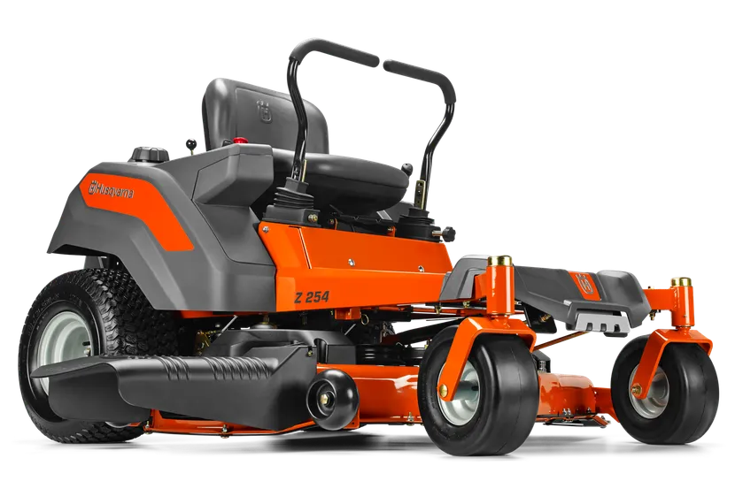
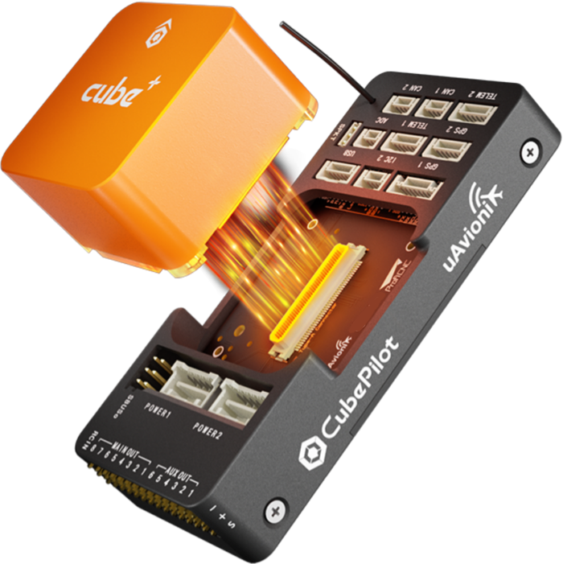
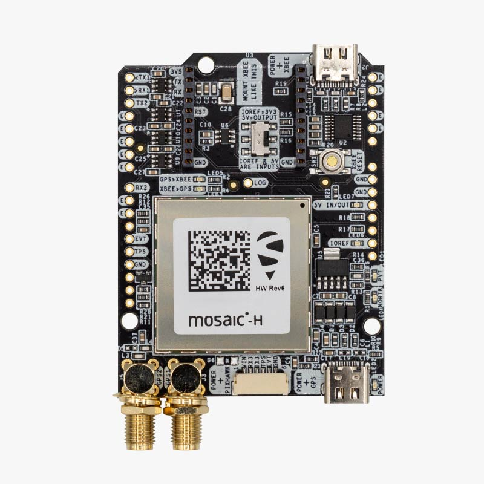
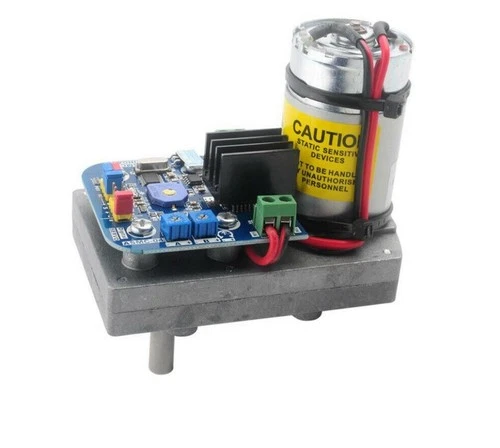
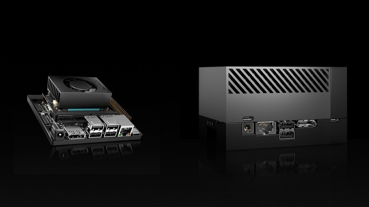
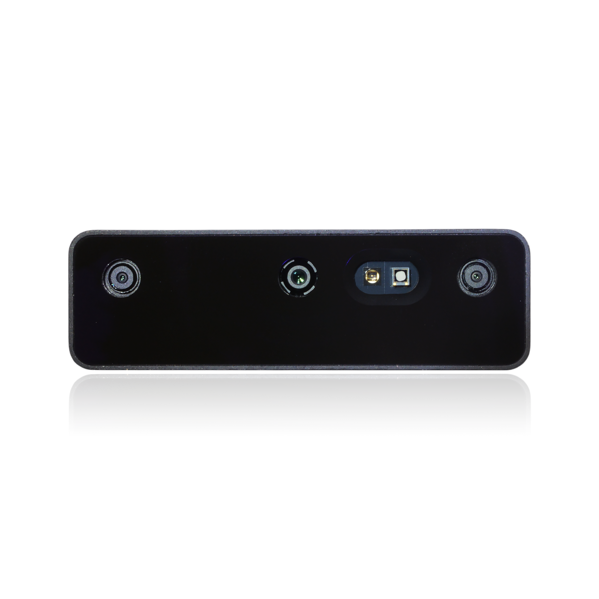
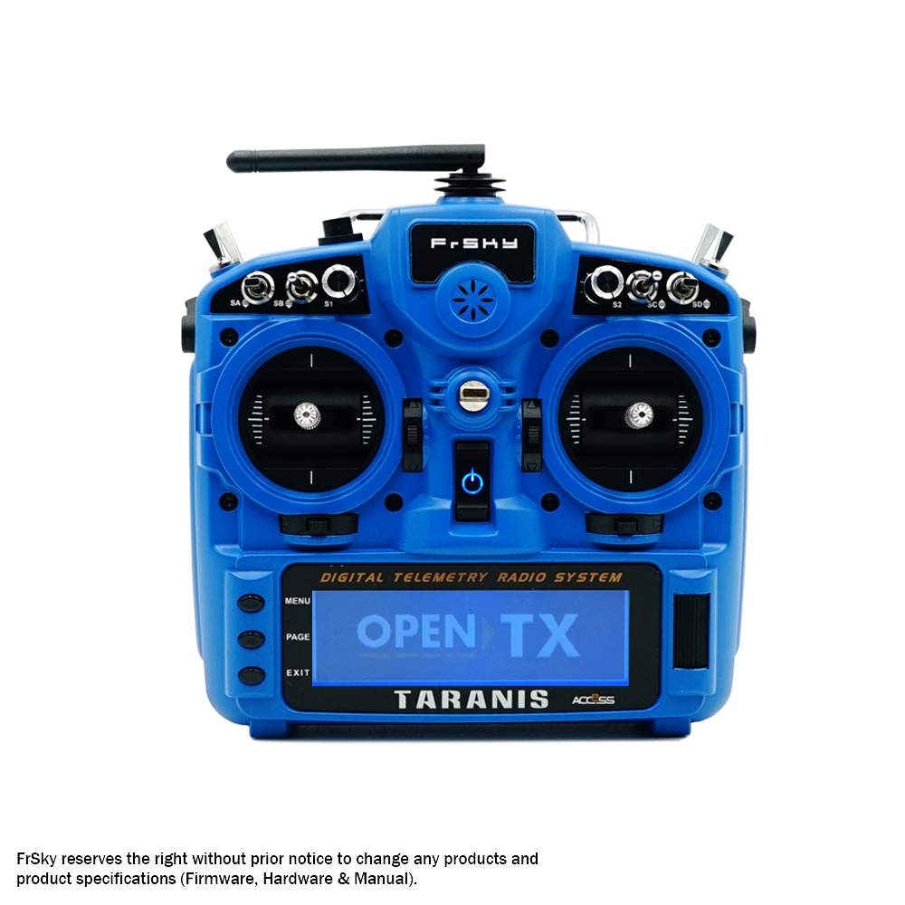
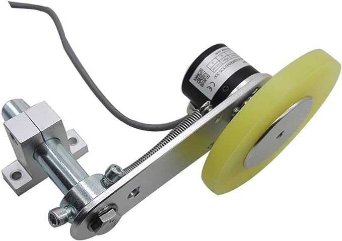
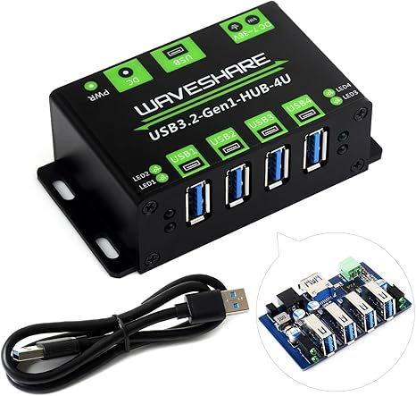
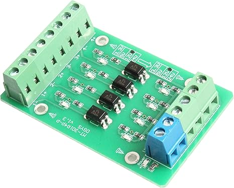

# Zero-Turn Mower Rover



[](https://youtube.com/shorts/XBVs-bLQMFM?si=tykpu-UtJFp_STtF)

CLI tooling suite for converting a Husqvarna Z254 zero-turn mower into an autonomous RTK-mowing robot.

This is **not** the autopilot firmware, **not** the physical build, and **not** a replacement for Mission Planner / QGroundControl. It fills the gaps between existing tools (ArduPilot, u-center, DepthAI, etc.) for a single operator working in a 4-acre yard.

## Hardware stack

| Component | Hardware |
|---|---|
| Flight controller | Pixhawk Cube Orange — ArduPilot Rover (skid-steer) |
| GNSS | ArduSimple simpleRTK3B Heading (Septentrio mosaic-H, dual-antenna GPS yaw) |
| Base station | simpleRTK2B Budget streaming RTCM3 over dedicated SiK radio |
| Steering | 2× ASMC-04A Robot Servo (12–24 V, back-driveable) |
| Companion computer | NVIDIA Jetson AGX Orin 64 GB (JetPack 6, 50 W mode) |
| Depth camera | Luxonis OAK-D Pro (USB, DepthAI v3) |
| Wheel encoders | 2× CALT GHW38 (200 PPR quadrature, push-pull) |
| USB hub | Waveshare 4-Ch USB 3.2 Gen1 HUB (VIA Labs VL817, powered, metal case) |
| Encoder level-shifting | NOYITO 4-Ch Optocoupler Isolator (5 V → 3.3 V) |
| Operator control | FrSky Taranis X9D Plus (OpenTX) transmitter (SBUS/FPort) + physical E-stop |

See [docs/vision/001-zero-turn-mower-rover.md](docs/vision/001-zero-turn-mower-rover.md) and [docs/research/001-mvp-bringup-rtk-mowing.md](docs/research/001-mvp-bringup-rtk-mowing.md) for full details.

---

### Husqvarna Z254 Zero-Turn Mower


The Husqvarna Z254 is the base vehicle — a residential zero-turn mower being converted into an autonomous RTK-mowing robot. Its dual-lever hydrostatic drive makes it a natural fit for skid-steer autopilot control.

**Key features:**

- Engine: Kawasaki FR691V V-twin, 726 cc, 23 HP
- Cutting deck: 54″ fabricated steel, 3-blade
- Drive: dual hydrostatic transmissions (EZT 2200), one per side
- Steering: twin lap bars (push/pull levers), spring-return-to-neutral
- Ground speed: 0–6.5 MPH forward, 0–3.5 MPH reverse
- Fuel capacity: 3.5 gallons
- Weight: ~530 lbs
- Cutting height: 1.5″–4.5″ (adjustable deck)

**How it's used in this project:**

- The twin hydrostatic levers are actuated by ASMC-04A servos for autonomous skid-steer control
- Spring-return-to-neutral on the levers provides mechanical failsafe — if servo power is cut, the mower stops
- Engine starter relay, blade clutch (PTO), and ignition kill are controlled via RC-passthrough relay outputs on the Cube Orange
- Inductive RPM pickup on the Kawasaki FR691V spark plug lead provides engine-running confirmation
- Blade clutch engagement is interlocked on confirmed engine-running (RPM ≥ idle threshold AND alternator voltage ≥ threshold)
- Physical E-stop cuts ignition + servo power via hardware relay — absolute authority over all software
- The 54″ deck and 4-acre yard drive the coverage planning parameters (boustrophedon path width, overlap %)

---

### Pixhawk Cube Orange



The Cube Orange is the flight controller at the heart of the rover. It runs **ArduPilot Rover** firmware in skid-steer mode, managing all low-level vehicle control — steering, throttle, mode transitions, failsafes, and sensor fusion.

**Key features:**

- STM32H757 dual-core processor (Cortex-M7 @ 400 MHz + Cortex-M4 @ 200 MHz)
- Triple-redundant IMUs with temperature-stabilised vibration isolation
- Dedicated failsafe co-processor (STM32F100)
- Autopilot-on-Module (AOM) form factor with standardized carrier board
- 14 PWM outputs (MAIN 1–8 + AUX 1–6)
- Multiple serial ports, CAN, I²C, SPI interfaces

**How it's used in this project:**

- Runs ArduPilot Rover in skid-steer frame (`FRAME_TYPE=0`)
- `SERVO1` / `SERVO3` (functions `73` / `74`) drive left/right steering servos
- `SERVO6`–`SERVO8` relay engine starter, blade clutch, and ignition kill via RC passthrough
- Receives RTK corrections over dedicated SiK radio (serial port, `MAVLINK=0`)
- Sends MAVLink telemetry to laptop over second SiK radio
- Accepts `VISION_POSITION_ESTIMATE` from Jetson for visual odometry fusion
- AUX pins used for wheel encoder inputs and RPM sensor
- EKF3 configured for GPS yaw (`EK3_SRC1_YAW=2`), no magnetometer

---

### ArduSimple simpleRTK3B Heading



The simpleRTK3B Heading provides centimeter-level RTK positioning **and** sub-degree heading from dual GNSS antennas — eliminating the need for a magnetometer (which is unreliable on a steel mower deck).

**Key features:**

- Septentrio mosaic-H dual-antenna GNSS module
- Multi-band (L1 + L2 + E5b), 448 hardware channels
- Multi-constellation: GPS, GLONASS, Galileo, BeiDou, QZSS, SBAS
- RTK fix: < 1 cm accuracy with base station up to 35 km
- Heading accuracy: 0.15° with 1 m antenna separation
- Update rate: up to 20 Hz in RTK+heading mode
- Native SBF (Septentrio Binary Format) protocol
- Operating temperature: −40 °C to +85 °C

**How it's used in this project:**

- Mounted on the rover with two GNSS antennas separated along the vehicle's longitudinal axis
- Provides position + yaw to the Cube Orange via serial (replacing magnetometer with `EK3_SRC1_YAW=2`)
- Receives RTCM3 corrections from the base station over a dedicated SiK radio link (no internet required)
- SBF protocol used for rover-side GNSS configuration and diagnostics

---

### ASMC-04A Robot Servo



The ASMC-04A is a high-torque programmable digital servo designed for robotics applications. Two of these convert the mower's hydrostatic steering levers from manual push/pull to autonomous PWM control.

**Key features:**

- Operating voltage: 12–24 V DC
- Stall torque: ~110 kg·cm at 24 V
- PWM control (standard RC servo signal)
- Programmable endpoints and speed
- **Back-driveable** gearbox — critical safety feature allowing manual override
- Metal gear train for durability

**How it's used in this project:**

- One servo on each hydrostatic steering arm (left = `SERVO1`, right = `SERVO3`)
- ArduPilot commands skid-steer via functions `73` (throttle left) and `74` (throttle right)
- Back-driveability is part of the safety chain: the operator can physically overpower the servos in an emergency, and spring-return-to-neutral on the levers provides mechanical failsafe
- Per-side calibration is mandatory — left and right hydrostatic levers are not symmetric
- `mower servo-cal` produces independent TRIM, MIN, MAX, REVERSED, and deadband profiles for each side

---

### NVIDIA Jetson AGX Orin Developer Kit



The Jetson AGX Orin is the companion computer responsible for visual SLAM, obstacle perception, and higher-level autonomy tasks that exceed the Cube Orange's real-time flight controller capabilities.

**Key features:**

- 64 GB LPDDR5 (204.8 GB/s memory bandwidth)
- 2048 CUDA cores / 16 Streaming Multiprocessors
- 64 Tensor Cores, 275 TOPS AI performance
- JetPack 6 / L4T 36.5 (aarch64, Ubuntu-based)
- Samsung 990 EVO Plus 2 TB NVMe SSD (PCIe Gen 4)
- AzureWave AW-CB375NF Wi-Fi 6E + Bluetooth 5.3
- Runs headless at nvpmodel mode 3 (50 W)

**How it's used in this project:**

- Runs RTAB-Map SLAM via the OAK-D Pro for visual odometry and loop closure
- Bridges VSLAM pose estimates to ArduPilot as `VISION_POSITION_ESTIMATE` / `VISION_SPEED_ESTIMATE` over MAVLink
- Hosts three systemd services: `mower-vslam`, `mower-vslam-bridge`, `mower-health`
- Connected to the Cube Orange via USB through a Waveshare 4-Ch USB 3.2 Gen1 powered hub
- Accessed from the operator laptop over SSH (key-based auth, no password)
- `mower jetson bringup` automates full provisioning from the laptop
- NVMe SSD stores RTAB-Map databases, structured logs, and model files

---

### Luxonis OAK-D Pro



The OAK-D Pro is a stereo depth camera with an integrated IR projector and IMU, providing the Jetson with the visual and inertial data needed for SLAM in outdoor environments.

**Key features:**

- Stereo pair: 2× OV9282 global shutter mono cameras (800P, 89.5° DFOV)
- Color camera: IMX378 (4K, auto-focus)
- 75 mm stereo baseline, ideal range ~80 cm – 12 m
- IR dot projector (940 nm, 4700 dots) for active stereo on low-texture surfaces
- IR flood LED for low-light / night vision
- Integrated BNO086 9-axis IMU
- USB 3.x SuperSpeed (5 Gbps) connection
- RVC2 (Myriad X) on-device AI processor

**How it's used in this project:**

- Provides 800P stereo frames @ 30 FPS to RTAB-Map for visual odometry
- IMU data fused with stereo for robust VSLAM pose estimation
- IR dot projector enabled at 750 mA for improved depth on grass/soil
- IR flood LED at 200 mA for dawn/dusk operation
- Boots in USB 2.0 (bootloader PID `03e7:2485`), firmware uploaded by DepthAI, re-enumerates at USB 3.x SuperSpeed (PID `03e7:f63b`)
- Requires udev rules, USB kernel params (no autosuspend, 1 GB usbfs, NO_LPM quirks)
- Camera pipeline configured via `/etc/mower/vslam.yaml`

---

### FrSky Taranis X9D Plus



The Taranis X9D Plus is the operator's handheld transmitter, providing manual override capability and at-handset telemetry display — ensuring the operator can always take control without needing the laptop.

**Key features:**

- OpenTX 2.3 firmware (open-source, fully configurable)
- 16 channels over ACCST D16 protocol (2.4 GHz)
- FrSky X8R receiver (SBUS output to Cube Orange RCIN)
- S.Port bidirectional telemetry (attitude, GPS, battery, mode displayed on-screen)
- Yaapu v1.8.0 telemetry script for live status
- Multiple 3-position and 2-position switches for mode/function control
- Hall-effect gimbals for precision

**How it's used in this project:**

- **Manual override:** SA 3-position switch = `MODE_CH=9` (Manual / Acro / Auto)
- **Arm/disarm:** SF 2-position switch = `RC7_OPTION=153`
- **Engine starter:** SB momentary → `SERVO6` (function `58`, RC passthrough)
- **Blade clutch:** SC 2-position → `SERVO7` (function `56`, RC passthrough)
- **Ignition kill:** SG 2-position → `SERVO8` (function `55`, RC passthrough, SF-arm-gated)
- S.Port passthrough telemetry on `SERIAL2_PROTOCOL=10` at 57600 baud
- Failsafe: `FS_THR_ENABLE=1`, `FS_THR_VALUE=910` — if signal lost, rover holds position
- The physical E-stop has absolute authority over both RC and GCS commands
- Taranis config is version-controlled in `config/taranis/` (EdgeTX YAML export)

---

### CALT GHW38 Wheel Encoder



The CALT GHW38 is a spring-loaded rotary encoder with a rubber contact wheel, used as a wheel encoder to provide ground-truth speed and distance feedback to the Cube Orange's EKF — complementing RTK position and visual odometry.

**Key features:**

- 200 PPR quadrature output (A/B channels, 800 counts/rev in 4× decode)
- Push-pull (totem pole) output driver
- 38 mm rubber contact wheel for slip-resistant surface measurement
- Spring-loaded pivot arm maintains constant wheel-to-surface pressure
- Steel mounting bracket with adjustable pivot
- Operating voltage: 5–24 V DC
- IP54-rated encoder body

**How it's used in this project:**

- Two encoders (one per side) measure left and right wheel ground speed independently
- Connected to Cube Orange AUX pins via ArduPilot `WENC` (wheel encoder) driver
- **Level-shifting is mandatory** — Cube Orange AUX pins are 3.3 V only; the GHW38 push-pull output at 5/12 V requires opto-isolation or level shifter to avoid damage
- Provides skid-steer odometry that detects wheel slip (RTK + encoders disagree = slip)
- Feeds the EKF as a velocity source for dead-reckoning during brief RTK dropouts (under trees, near structures)
- Per-side calibration accounts for tire diameter differences and encoder mounting geometry

---

### Waveshare 4-Ch USB 3.2 Gen1 HUB



The Waveshare USB 3.2 Gen1 HUB is an industrial-grade powered USB hub that connects the OAK-D Pro and Pixhawk Cube Orange to the Jetson AGX Orin over a single upstream USB 3.x link. Its external power input ensures stable 5 V supply to high-draw USB devices.

**Key features:**

- 4× USB 3.2 Gen1 (5 Gbps) downstream ports
- VIA Labs VL817 hub controller (USB-IF certified)
- External DC 5 V power input — does not draw bus power from host
- Metal enclosure with wall-mount brackets for vibration resistance
- Per-port over-current protection
- LED indicators per port for connection status
- Driver-free, plug-and-play on Linux / Windows / macOS

**How it's used in this project:**

- Upstream port connects to the Jetson AGX Orin via USB 3.x
- Downstream port 1: Luxonis OAK-D Pro (stereo camera + IMU, requires sustained 5 Gbps bandwidth)
- Downstream port 2: Pixhawk Cube Orange (MAVLink serial over USB)
- External 5 V supply ensures the OAK-D Pro's MyriadX boot sequence and IR projector operate without USB power budget issues
- Mounted inside the rover's electronics enclosure with wall-mount brackets to resist mowing vibration
- USB device IDs confirmed: OAK-D bootloader `03e7:2485` → booted `03e7:f63b`; Cube Orange `2DAE:1016`

---

### NOYITO 4-Channel Optocoupler Isolator



The NOYITO 4-channel optocoupler module provides galvanic isolation and level-shifting between the wheel encoders' 5 V push-pull outputs and the Cube Orange's 3.3 V AUX inputs — protecting the flight controller from overvoltage damage.

**Key features:**

- 4 independent optocoupler channels (photoelectric isolation)
- Input: PNP or NPN signals, 3.3–24 V
- Output: NPN open-collector, pulled to 3.3 V on output side
- Galvanic isolation between input and output sides
- Screw terminal blocks for secure field wiring
- Compact PCB with mounting holes
- Response speed suitable for quadrature encoder signals at mowing speeds

**How it's used in this project:**

- Channels 1–2: Left encoder A/B quadrature signals (5 V → 3.3 V)
- Channels 3–4: Right encoder A/B quadrature signals (5 V → 3.3 V)
- Input side powered from encoder 5 V supply; output side powered from Cube Orange 3.3 V rail
- Provides mandatory level-shifting — Cube Orange AUX pins are **not** 5 V tolerant
- Galvanic isolation protects the flight controller from ground loops and transients induced by the mower's electrical system
- Screw terminals allow secure connections that withstand mowing vibration without the fragility of DuPont jumpers

---

## Install

Requires Python 3.11+. Recommended via [`pipx`](https://pipx.pypa.io/):

```
pipx install .
```

Or, for development with [`uv`](https://docs.astral.sh/uv/):

```
uv sync --extra dev
```

### Jetson install

On the rover's Jetson AGX Orin (JetPack 6 / Ubuntu, aarch64):

```
pipx install .[jetson]
```

This installs `mower-jetson` with Jetson-specific extras (`sdnotify`, `depthai`). Configure key-based SSH from the laptop to the Jetson user before using `mower jetson` from the laptop side (no password auth — `mower jetson` runs OpenSSH with `BatchMode=yes`).

## Commands

### Laptop (`mower`)

| Command | Description |
|---|---|
| `mower detect` | Read-only hardware enumeration over MAVLink (autopilot, GNSS, servos, radio, EKF) |
| `mower params snapshot OUT.json` | Fetch every autopilot param to a JSON snapshot |
| `mower params diff LEFT RIGHT` | Diff two param files (YAML / JSON snapshot / `.parm`); pass `baseline` for the shipped Z254 baseline |
| `mower params apply FILE` | Snapshot → diff → confirm → write params to autopilot. Honors `--dry-run` and `--yes` |
| `mower jetson setup` | Interactive first-time Jetson connectivity wizard |
| `mower jetson bringup` | Automated end-to-end Jetson provisioning |
| `mower jetson run -- CMD…` | Run `CMD` on the Jetson over SSH (key auth only) |
| `mower jetson pull REMOTE LOCAL` | Copy a file from the Jetson to the laptop; prompts on overwrite (`--yes` to bypass) |
| `mower jetson info` | Run `mower-jetson info --json` over SSH and print parsed result |
| `mower vslam health` | Display VSLAM bridge health received over MAVLink |
| `mower version` | Print the installed version |

Endpoint resolution for `mower jetson …`: `--host/--user/--port/--key` flags
→ `MOWER_JETSON_HOST` / `MOWER_JETSON_USER` / `MOWER_JETSON_PORT` / `MOWER_JETSON_KEY`
env vars → `~/.config/mower-rover/laptop.yaml` (Linux/macOS) or
`%APPDATA%\mower-rover\laptop.yaml` (Windows). Example:

```yaml
jetson:
  host: 10.0.0.42
  user: mower
  port: 22
  key_path: ~/.ssh/mower_id_ed25519
```

### Jetson (`mower-jetson`)

| Command | Description |
|---|---|
| `mower-jetson detect` | Detect connected hardware over local USB |
| `mower-jetson info` | Platform identity (hostname, kernel, JetPack release). `--json` for machine output |
| `mower-jetson config show` | Print resolved Jetson YAML config (`--config PATH` to override) |
| `mower-jetson probe` | Run pre-flight readiness checks (CUDA, OAK-D, USB tuning, thermal, disk, SSH, VSLAM…) |
| `mower-jetson thermal` | Live thermal zone monitor (`--watch` for continuous) |
| `mower-jetson power` | Power / performance state snapshot |
| `mower-jetson service install` | Install and enable the `mower-health` systemd service |
| `mower-jetson service uninstall` | Stop and remove the `mower-health` systemd service |
| `mower-jetson vslam install` | Install and enable VSLAM systemd services (`mower-vslam`, `mower-vslam-bridge`) |
| `mower-jetson vslam uninstall` | Stop and remove VSLAM systemd services |
| `mower-jetson version` | Print the installed version |

Default Jetson config path: `~/.config/mower-rover/jetson.yaml`.

## Architecture

```
┌─────────────────────────────┐       SSH / SCP       ┌──────────────────────────────────┐
│  Operator laptop (Windows)  │◄─────────────────────►│  Jetson AGX Orin (aarch64)       │
│                             │                        │                                  │
│  mower detect               │                        │  mower-jetson info / probe       │
│  mower params …             │   MAVLink (SiK radio)  │  mower-jetson thermal / power    │
│  mower jetson …             │◄─────────────────────►│                                  │
│  mower vslam health         │                        │  ┌──────────────────────────┐    │
│                             │                        │  │ mower-vslam.service      │    │
└─────────────────────────────┘                        │  │ (rtabmap_slam_node C++)  │    │
                                                       │  │ OAK-D Pro → RTAB-Map     │    │
        ┌──────────────────┐                           │  └──────────┬───────────────┘    │
        │  Cube Orange     │   MAVLink (serial)        │             │ Unix socket IPC    │
        │  ArduPilot Rover │◄─────────────────────────│  ┌──────────▼───────────────┐    │
        │  (skid-steer)    │   VISION_POSITION_EST     │  │ mower-vslam-bridge.svc   │    │
        └──────────────────┘   VISION_SPEED_EST        │  │ FLU→NED, MAVLink fwd    │    │
                                                       │  └──────────────────────────┘    │
                                                       │                                  │
                                                       │  mower-health.service            │
                                                       │  (disk, thermal, power watchdog) │
                                                       │                                  │
                                                       │  ┌──────────────────────────┐    │
                                                       │  │ mower-kiosk-data.service │    │
                                                       │  │ (Python, telemetry JSON) │    │
                                                       │  └──────────┬───────────────┘    │
                                                       │             │ Unix socket IPC    │
                                                       │  ┌──────────▼───────────────┐    │
                                                       │  │ mower-kiosk-renderer.svc │    │
                                                       │  │ (C/LVGL 9.5, Wayland)   │    │
                                                       │  └──────────────────────────┘    │
                                                       │                                  │
                                                       │  mower-weston.service            │
                                                       │  (Wayland compositor, pixman)    │
                                                       └──────────────────────────────────┘
```

### VSLAM pipeline

1. **`mower-vslam.service`** — C++ RTAB-Map SLAM node (`contrib/rtabmap_slam_node/`) reads stereo + IMU from the OAK-D Pro via DepthAI, runs visual odometry and loop closure, outputs 6-DOF poses over a Unix socket.
2. **`mower-vslam-bridge.service`** — Python bridge (`src/mower_rover/vslam/bridge.py`) reads poses from the Unix socket, converts FLU → NED, and forwards `VISION_POSITION_ESTIMATE` / `VISION_SPEED_ESTIMATE` to the Cube Orange over MAVLink.
3. **ArduPilot Lua script** (deployed via `mower-jetson vslam install` / `lua_deploy.py`) enables EKF source switching between GPS and visual odometry.

### Kiosk pipeline

1. **`mower-weston.service`** — Wayland compositor (pixman renderer on Tegra234 card0, `seatd` seat backend).
2. **`mower-kiosk-data.service`** — Python daemon (`mower-jetson kiosk run`) aggregates health/VSLAM/MAVLink telemetry and publishes JSON frames to `/run/mower/kiosk-display.sock`.
3. **`mower-kiosk-renderer.service`** — Native C/LVGL 9.5 binary (`contrib/lvgl_kiosk/`) renders an 8-card dashboard (VSLAM, Vehicle, GPS/RTK, System Health, Storage, Wi-Fi, Services, Alerts) at ~30 FPS with high-contrast outdoor colors via Wayland SHM (NEON-accelerated software rendering, no EGL/GL).

### Jetson systemd services

| Service | Type | Purpose |
|---|---|---|
| `mower-health.service` | `Type=notify` | Disk, thermal, and power health watchdog |
| `mower-vslam.service` | — | RTAB-Map SLAM node (C++ binary) |
| `mower-vslam-bridge.service` | — | VSLAM → MAVLink bridge (Python) |
| `mower-weston.service` | — | Wayland compositor (pixman renderer, seatd backend) |
| `mower-kiosk-data.service` | `Type=notify` | Python telemetry aggregator publishing JSON to Unix socket |
| `mower-kiosk-renderer.service` | `Type=notify` | Native C/LVGL 9.5 dashboard rendering to Wayland |
| `mower-mavproxy.service` | — | MAVProxy for MAVLink access sharing |

All are **system-level** units installed to `/etc/systemd/system/`. They are `enable`d at install time so they start automatically on boot.

#### VSLAM service architecture

The VSLAM service holds a persistent `dai::Device()` connection to the OAK-D Pro. Without it, the camera stays in its bootloader state (PID `03e7:2485`, USB 2.0) because DepthAI firmware is RAM-volatile and must be uploaded every boot.

**Unit files:**

```
/etc/systemd/system/mower-vslam.service
/etc/systemd/system/mower-vslam-bridge.service
/etc/systemd/system/mower-health.service
/etc/systemd/system/mower-weston.service
/etc/systemd/system/mower-kiosk-data.service
/etc/systemd/system/mower-kiosk-renderer.service
/etc/systemd/system/mower-mavproxy.service
```

**Inspecting service status:**

```bash
sudo systemctl status mower-vslam.service
sudo journalctl -u mower-vslam -f          # live logs
sudo journalctl -u mower-vslam-bridge -f   # bridge logs
```

**Expected steady-state (60 s after boot):**

- `mower-vslam.service` — `enabled` + `active (running)`
- OAK-D sysfs: `idProduct=f63b`, `speed=5000` (USB 3.x SuperSpeed)
- Socket exists: `/run/mower/vslam-pose.sock`

The `/run/mower/` directory is created natively by `RuntimeDirectory=mower` in the system-level VSLAM unit — no `tmpfiles.d` or manual `mkdir` required.

**Corrupt RTAB-Map database quarantine:**

If `~/.ros/rtabmap.db` fails an integrity check during bringup, it is renamed to `~/.ros/rtabmap.db.corrupt-{ISO8601_TIMESTAMP}` and RTAB-Map creates a fresh database on next start. To clean up old quarantine files:

```bash
ls ~/.ros/rtabmap.db.corrupt-*          # list quarantined DBs
rm ~/.ros/rtabmap.db.corrupt-*          # remove all (safe — originals were corrupt)
```

#### Rolling back to user-level units

If you need to revert the system-level service migration (e.g., for testing or debugging with user-level units):

1. Stop the system-level services:

   ```bash
   sudo systemctl stop mower-vslam-bridge.service mower-vslam.service mower-health.service
   ```

2. Disable them (removes `WantedBy` symlinks):

   ```bash
   sudo systemctl disable mower-vslam-bridge.service mower-vslam.service mower-health.service
   ```

3. Remove the unit files:

   ```bash
   sudo rm /etc/systemd/system/mower-{health,vslam,vslam-bridge}.service
   ```

4. Reload the systemd daemon:

   ```bash
   sudo systemctl daemon-reload
   ```

5. On the operator laptop, set the config flag to user-level:

   - Linux/macOS: edit `~/.config/mower-rover/jetson.yaml`
   - Windows: edit `%APPDATA%\mower-rover\jetson.yaml`

   ```yaml
   service_user_level: true
   ```

6. Re-run bringup from the service step:

   ```bash
   mower jetson bringup --from-step service
   ```

The cleanup pre-step is a no-op in this direction (no user units exist to remove), and the install path will write to `~/.config/systemd/user/`.

#### Steady-state verification

After a fresh bringup or reboot, verify the system has converged (wait ~60 s):

```bash
# Probe reports OAK-D booted and VSLAM active
mower-jetson probe --json | python3 -c "
import json, sys
d = json.load(sys.stdin)
checks = {c['name']: c for c in d['checks']}
oakd = checks.get('oakd', {})
print(f\"oakd: {oakd.get('status', 'MISSING')}\")
assert oakd.get('status') == 'PASS', f\"oakd not PASS: {oakd}\"
"

# No service restarts in last 60 s
sudo systemctl show mower-vslam --property=NRestarts --value  # should be 0

# IPC socket exists
test -S /run/mower/vslam-pose.sock && echo "socket OK" || echo "socket MISSING"
```

### Health monitoring & pre-flight probes

The `mower-jetson probe` command runs dependency-ordered checks:

- **CUDA** — toolkit availability
- **OAK-D** — USB enumeration and device presence
- **USB tuning** — kernel params (`usbcore.autosuspend`, `usbfs_memory_mb`)
- **Disk** — free space and NVMe detection
- **Thermal** — zone accessibility
- **Power mode** — Jetson nvpmodel validation
- **Python version** — compatibility check
- **SSH hardening** — password auth disabled, root login disabled
- **JetPack** — release detection
- **VSLAM** — RTAB-Map and DepthAI readiness

### Safety

Every actuator-touching command goes through the safety primitive:

- **Confirmation prompt** — explicit operator approval before writes
- **`--dry-run` mode** — preview changes without applying
- **Central safe-stop hook** — registered cleanup on abort
- **Physical E-stop** — hardware relay has absolute authority (not software-bypassable)

## Configuration

Three YAML config files, resolved in order (flags → env vars → file):

| File | Platform | Default path |
|---|---|---|
| `laptop.yaml` | Windows / macOS / Linux | `%APPDATA%\mower-rover\laptop.yaml` or `~/.config/mower-rover/laptop.yaml` |
| `jetson.yaml` | Jetson (aarch64) | `~/.config/mower-rover/jetson.yaml` |
| `vslam.yaml` | Jetson (aarch64) | `~/.config/mower-rover/vslam.yaml` |

## Scripts

| Script | Purpose |
|---|---|
| `scripts/jetson-harden.sh` | Idempotent Jetson field-hardening (headless mode, USB tuning, udev rules, SSH hardening, RTAB-Map / DepthAI build, service setup) |
| `scripts/90-pixhawk-usb.rules` | udev rules for Pixhawk USB device permissions and symlink |

## Project layout

```
src/mower_rover/
├── cli/            # Typer CLI apps (laptop + jetson)
├── config/         # YAML config loading and validation
├── health/         # Disk, thermal, and power monitoring
├── logging_setup/  # structlog JSON + console, correlation IDs
├── mavlink/        # MAVLink connection with retry/reconnect
├── params/         # ArduPilot param snapshot / diff / apply
├── probe/          # Pre-flight check framework + individual checks
├── safety/         # Confirmation prompts, dry-run, safe-stop hooks
├── service/        # systemd unit generation and daemon framework
├── transport/      # SSH/SCP wrapper (laptop → Jetson)
└── vslam/          # VSLAM bridge, IPC, frame transforms, Lua deploy

contrib/rtabmap_slam_node/  # C++ RTAB-Map SLAM node (builds on Jetson)
contrib/lvgl_kiosk/         # C/LVGL kiosk renderer (Wayland, builds on Jetson)
scripts/                    # Hardening and udev rules
docs/                       # Vision, research, plans, procedures, field notes
```

## Test

```
pytest -m "not field and not sitl"        # fast unit tests, all platforms
pytest -m sitl                             # requires sim_vehicle.py on PATH (Linux/WSL2)
```

| Marker | Scope |
|---|---|
| *(unmarked)* | Unit tests — pure logic, mocked dependencies |
| `@pytest.mark.sitl` | Requires ArduPilot SITL (`rover-skid` frame) |
| `@pytest.mark.field` | Requires physical hardware (excluded from CI) |
| `@pytest.mark.jetson` | Requires a real Jetson device |

SITL is a **smoke-test harness** for MAVLink plumbing, param round-trips, mode transitions, and dry-run paths. It is **not** a tuning tool — the kinematic model has no mass, friction, or hydrostatics.

## Development with GitHub Copilot Custom Agents

This project was developed entirely through a structured AI-assisted workflow using **GitHub Copilot** with a suite of custom agents (the "PCH" agent chain). Each agent specializes in one phase of the software engineering lifecycle, enforcing separation of concerns and producing auditable documentation at every step.

### The agent workflow

```
Idea → pch-visionary → pch-researcher → pch-planner → pch-plan-reviewer → pch-coder → Explore
```

| Agent | Role | Output |
|---|---|---|
| **pch-visionary** | Transforms raw ideas into structured vision documents through guided Q&A, combining business analyst and solution architect perspectives | Vision doc with goals, stakeholders, requirements (FRs/NFRs), constraints, stages, and non-goals |
| **pch-researcher** | Creates phased research outlines, then delegates phase execution to subagents for deep technical investigation | Research doc with findings, parameter values, library evaluations, hardware confirmations, and open questions |
| **pch-planner** | Creates highly detailed implementation plans with decision logs, execution phases, and file-level specifications | Versioned plan doc (v1.0 → v2.0+) with decision session log, holistic review, and numbered execution steps |
| **pch-plan-reviewer** | Reviews implementation plans for correctness, clarity, and specificity before implementation begins | Review session log with questions, decisions, and plan patches (bumps version, e.g. v2.1, v2.2) |
| **pch-coder** | Executes implementation plan steps with precise, production-ready code following established patterns | Working code, tests, and config committed against plan phases |
| **pch-helper** | Guides users on how to effectively use the PCH agent workflow and provides advice on agent selection and sequencing | Workflow guidance and troubleshooting |
| **Explore** | Fast read-only codebase exploration and Q&A subagent for searching and understanding existing code | Targeted answers about code structure, patterns, and references |

### How it works in practice

1. **Vision (once):** The [vision document](docs/vision/001-zero-turn-mower-rover.md) was created by `pch-visionary` through an interactive Q&A session, capturing the project's goals, constraints, hardware stack, and success metrics. It serves as the authoritative "what and why" contract.

2. **Research (per feature area):** Before any code is written, `pch-researcher` investigates the open technical questions. The [21 research documents](docs/research/) cover topics from RTK base station configuration to VSLAM integration to multi-zone lawn management. Each research doc cites specific hardware specs, library APIs, ArduPilot parameters, and confirms or supersedes assumptions from the vision.

3. **Planning (per implementation):** `pch-planner` produces a detailed plan with numbered decision points (answered interactively), a holistic review of decision interactions, and a phased execution plan with file paths, function signatures, and test strategies. Plans reference their source research doc and vision requirements explicitly. The [18 plan documents](docs/plans/) range from parameter management to CI fixes to firmware updates.

4. **Review (mandatory gate):** `pch-plan-reviewer` audits each plan for correctness — catching issues like wrong enum values, missing exports, incorrect file paths, or underspecified edge cases. The reviewer's fixes are recorded in a "Review Session Log" table and bump the plan version (e.g., v2.0 → v2.1 → v2.2). No plan proceeds to implementation without passing review.

5. **Implementation:** `pch-coder` executes the reviewed plan phase by phase, following the file paths, signatures, and patterns specified in the plan. The coder does not freelance — deviations from the plan are flagged, not silently introduced.

### What this approach produces

- **Full traceability:** Every line of code traces back through plan → research → vision requirements
- **Auditable decisions:** Decision logs capture *why* each technical choice was made (e.g., "Unix socket IPC, not shared memory, because..." or "source build RTAB-Map, not apt package, because...")
- **Catch-before-code:** The review gate catches bugs at the design level — wrong parameter names, missing edge cases, incorrect assumptions — before any code is written
- **Living documentation:** The docs aren't afterthoughts; they're the primary artifacts that drive implementation. The 21 research docs and 18 plans constitute the project's engineering record

### The copilot-instructions contract

The [.github/copilot-instructions.md](.github/copilot-instructions.md) file provides all agents with shared context: the hardware stack, tooling choices, naming conventions, safety constraints, and explicit "things to avoid." This ensures every agent — whether researching, planning, or coding — operates with the same ground truth about the physical system.

## License

MIT
